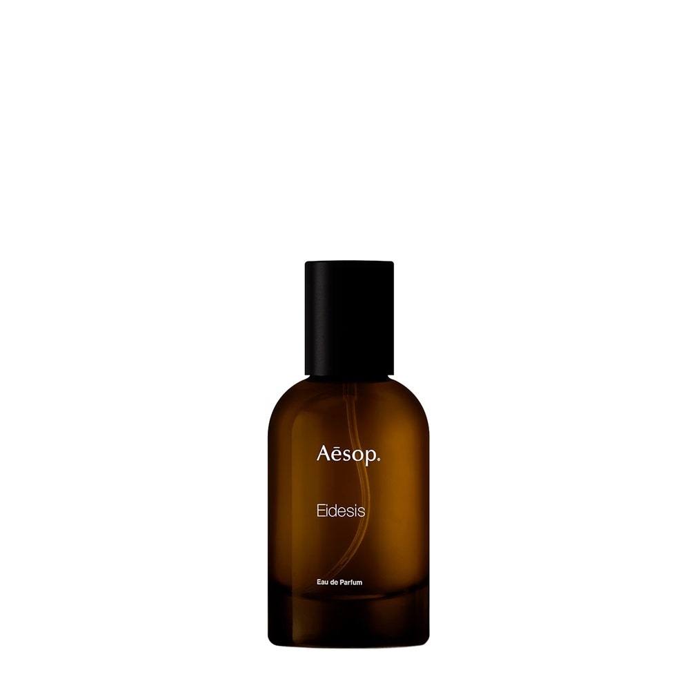

> 是垂影自怜，是回首张望的时候反复爱上自己

---

**品牌** ｜ 伊索 Aesop  
**香水** ｜ 镜之密语 Eidesis  
**香调** ｜ 木质东方调

---

### 香调结构

- **前调**：苦橙、黑胡椒、花香
- **中调**：乳香、小茴香、雪松  
- **基调**：檀香、雪松、岩兰草

---

### 我的香评

是我。

是纳西索斯，是水仙之恋，是自我的镜像映射。

是垂影自怜，是回首张望的时候反复爱上自己。

无论是语意，还是香水本身，都在表达「我」。

雪松悠远清透的气息之中，有一点点烟熏味和黑胡椒，乳香和雪松交融。果然是我最喜欢的气息。

最能代表我的一瓶香水——无论是气味还是寓意，都在深度表达我。
