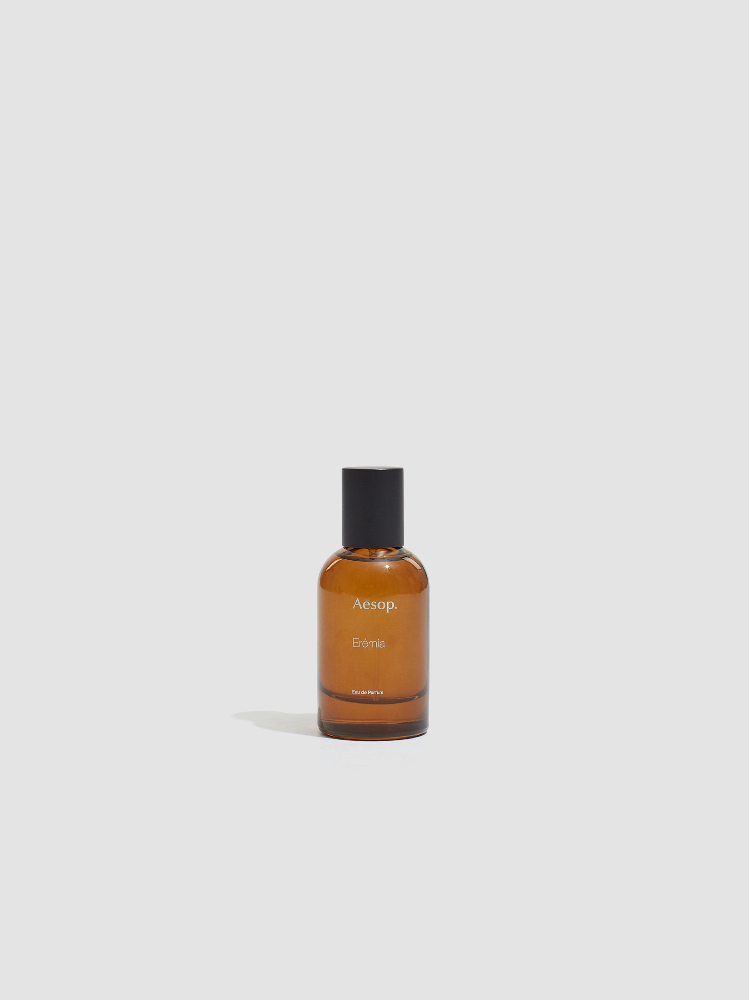

> 中药房里十年的温润如玉的中医身上的药香

---

**品牌** ｜ 伊索 Aesop  
**香水** ｜ 苍旻 Eremia  
**香调** ｜ 芳香木质调

---

### 香调结构

- **前调**：苦橙、榄香脂、薰衣草、杜松子
- **中调**：干草、洋甘菊、乳香、迷迭香  
- **基调**：没药、零陵香豆、广藿香、岩兰草

---

### 我的香评

中药房里十年的温润如玉的中医身上的药香。

最后种草的一瓶苦苦的香水——就像熬了十天的中药，尾调也是苦的，像中医。

苦橙与榄香脂的开头带着草药的清苦，洋甘菊与乳香在中调渐渐温和下来，最终归于没药与广藿香的沉稳。整个过程就像一剂中药在时间里缓缓释放。
