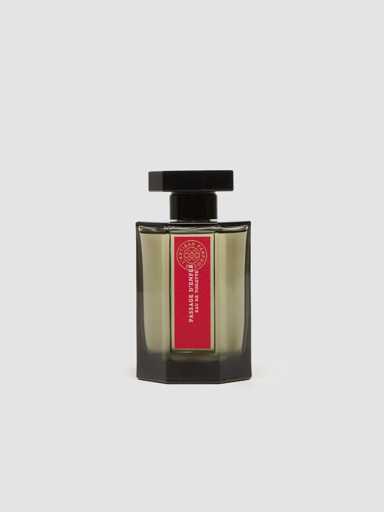

> 温暖的夜晚里的虚无之河

---

**品牌** ｜ 阿蒂仙之香 L'Artisan Parfumeur  
**香水** ｜ 冥府之路 Passage d'Enfer  
**香调** ｜ 木质东方调

---

### 香调结构

- **前调**：玫瑰、姜
- **中调**：乳香、芦荟木、野百合、大西洋杉木  
- **基调**：檀香、安息香、麝香

---

### 我的香评

温暖的夜晚里的虚无之河。

玫瑰与姜的开场带着微微的暖意，乳香与芦荟木在中调铺开一条看不见尽头的河流。檀香与安息香的基调像是夜色本身——温暖、沉静、无边无际。

这是一瓶关于「虚无」的香水，却用最温暖的方式讲述。
