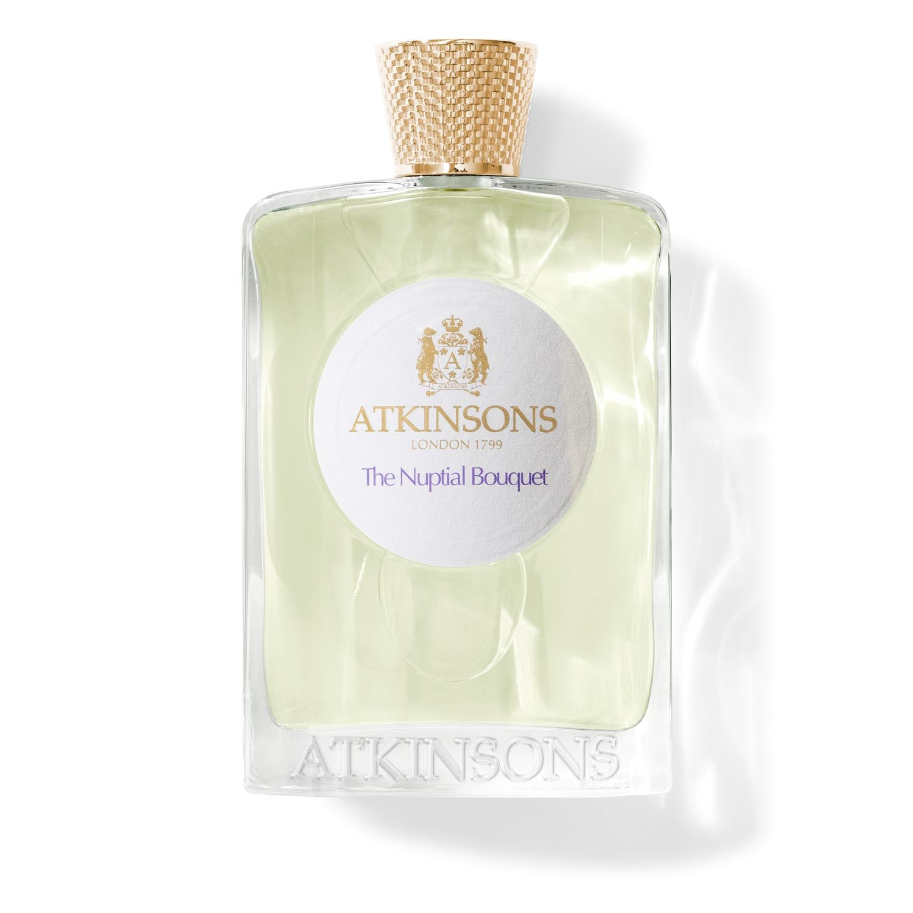

> 是清透的夏天，是白衣的少年，是雨后的柔风拂面

---

**品牌** ｜ 阿克金森 Atkinsons  
**香水** ｜ 无根之水 Nuptial Bouquet  
**香调** ｜ 柑橘花香调

---

### 香调结构

- **前调**：葡萄柚、佛手柑、橙子
- **中调**：雪松、广藿香、天竺葵  
- **基调**：木质香、麝香

---

### 我的香评

是清透的夏天

是白衣的少年

是雨后的柔风拂面　微凉又微暖

在朋友闲逛的夜晚接受安利种草。前者就像夏日的白衣少年——葡萄柚与佛手柑的清新开场，像是午后阳光穿过白衬衫的透亮感。
