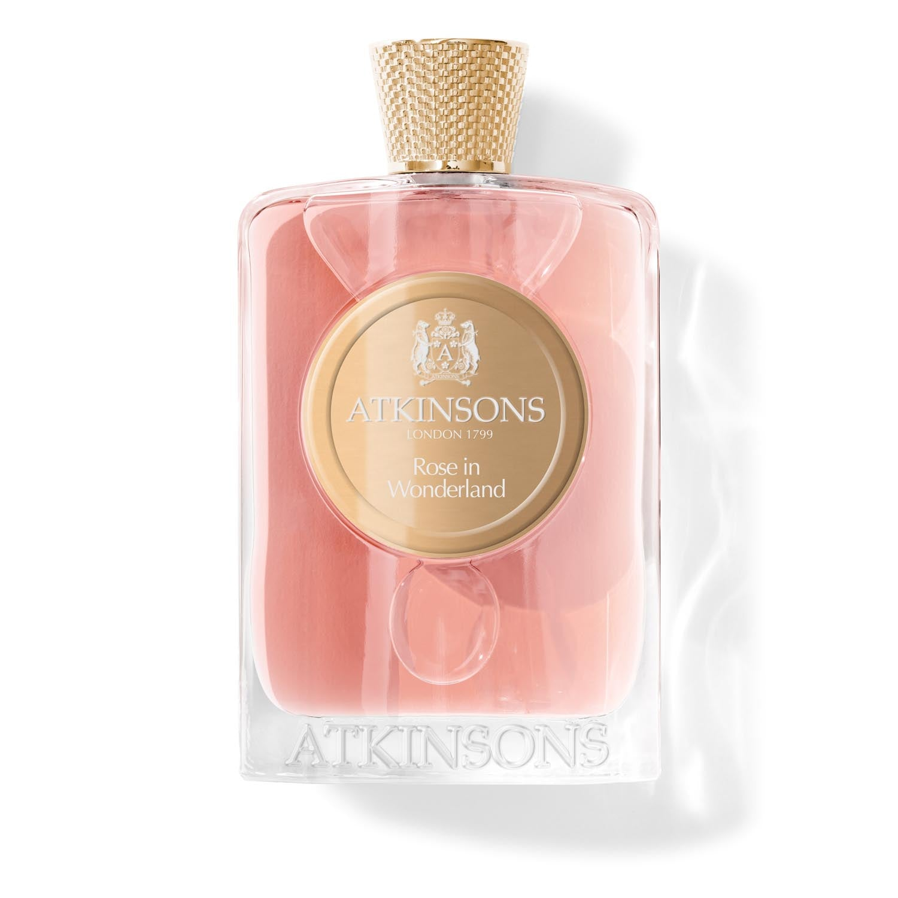

> 荔枝一样晶莹甜美的少女

---

**品牌** ｜ 阿克金森 Atkinsons  
**香水** ｜ 玫瑰梦境 Rose in Wonderland  
**香调** ｜ 木质花香调

---

### 香调结构

- **前调**：玫瑰、黑醋栗芽
- **中调**：千叶玫瑰、天竺葵  
- **基调**：香根草、水晶琥珀

---

### 我的香评

荔枝一样晶莹甜美的少女气息。

玫瑰与黑醋栗芽的开场清甜可人，千叶玫瑰在中调绽放得明媚又温柔。

如果无根之水是夏日的白衣少年，那玫瑰梦境就是果园里笑着跑过来的甜美少女——带着荔枝的透明感和玫瑰的柔软。

我和朋友都觉得这两瓶香水，无论是颜色、还是实际的香调，都堪称CP香，适合春夏年少的少年少女。
