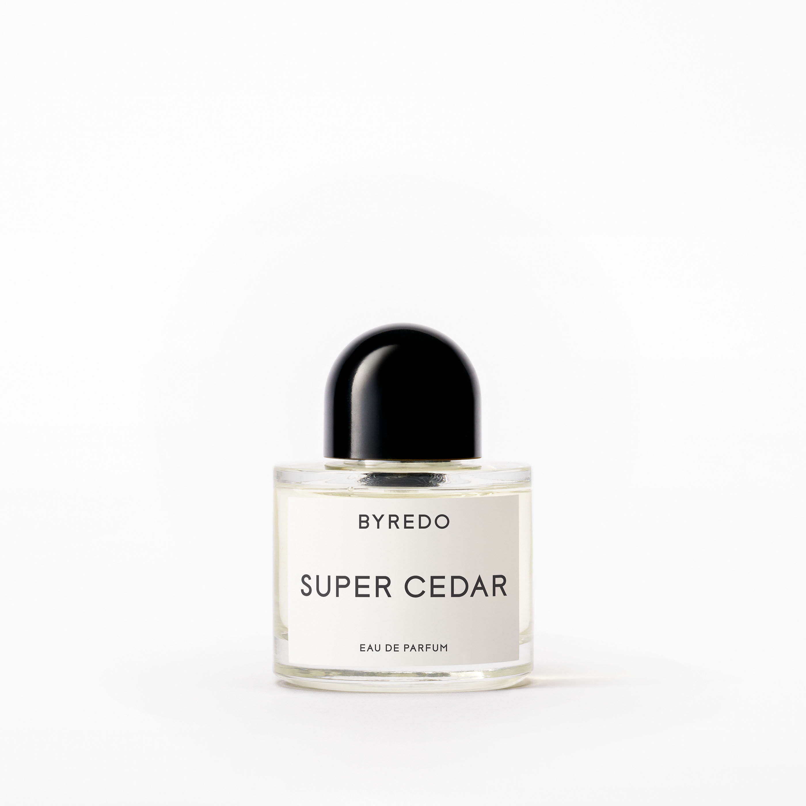

> 秋天清晨，太阳升起之前清冽的风

---

**品牌** ｜ 柏芮朵 Byredo  
**香水** ｜ 超级雪松 Super Cedar  
**香调** ｜ 木质花香调

---

### 香调结构

- **前调**：玫瑰
- **中调**：弗吉尼亚雪松  
- **基调**：海地香根草、麝香

---

### 我的香评

秋天清晨，太阳升起之前清冽的风。

极简的香调结构——玫瑰开场，弗吉尼亚雪松主导中调，海地香根草与麝香收尾。像是一幅只用了三种颜色的水墨画，干净利落。

如果雪松旅馆是冬日壁炉旁的温暖，超级雪松则是深秋破晓前的那一阵清风——冷冽、干净、让人清醒。
