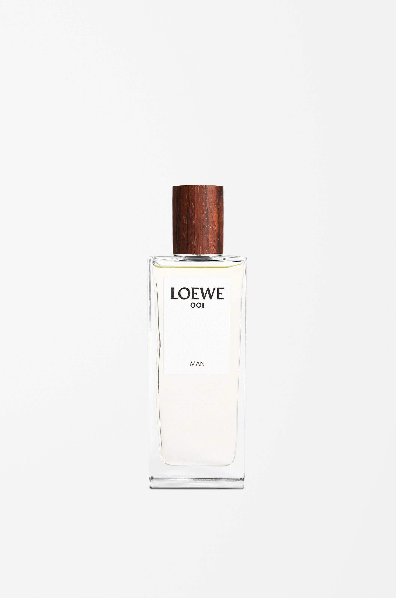

> 云消雨散之后，才是逐渐柔和温暖的后调奶檀，犹如缠绵又眷恋的吻

---

**品牌** ｜ 罗意威 Loewe  
**香水** ｜ 001 事后清晨 001 Man  
**香调** ｜ 木质花香调

---

### 香调结构

- **前调**：香柠檬、佛手柑、蜜橘、生姜
- **中调**：橙子花、鸢尾、胡萝卜籽  
- **基调**：檀香、顿加豆、白麝香、柏树

---

### 我的香评

前调是很重的花椒味——胡萝卜籽带来的辛辣感，强势霸道，侵略性很强，长驱直入。

要等到很久，云消雨散之后，才是逐渐柔和温暖的后调奶檀，犹如缠绵又眷恋的吻。

严格意义上来说，这款香水并不算"事后"——可能是被名称暗示。更像是对 sex 本身的一种隐喻：前调强势霸道，完全被花椒味占据；后调才是云消雨散后的柔和与温暖。

我记得第一次被推荐这款香水的场景。在上海某家餐厅准备吃晚饭，朋友说这款留香很久，早上喷的现在还有余香，然后伸手腕过来让我嗅。

那一刻我真的感激我的鼻子很争气——我精确地捕捉到了后调那种柔和温暖的甜甜的檀香气息。

不过遗憾的是，我的体温不够，哪怕重试一万次，再也无法复现当时的气息。
