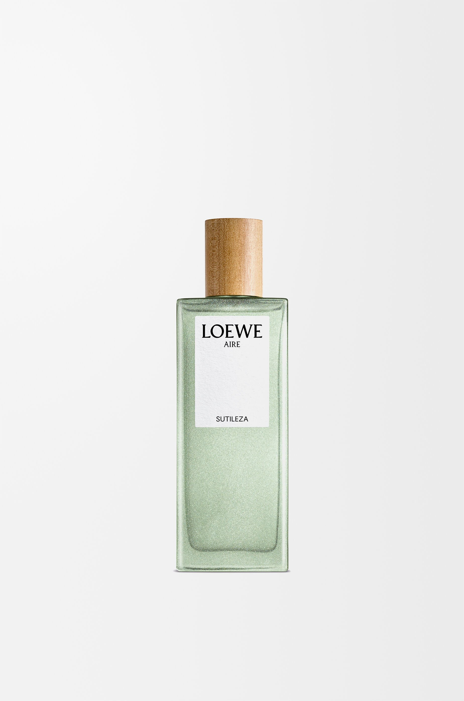

> 春天清晨的第一缕光——轻盈、透亮、不张扬

---

**品牌** ｜ 罗意威 Loewe  
**香水** ｜ 奇迹天光 Aire Sutileza  
**香调** ｜ 花香调

---

### 香调结构

- **前调**：梨子、蜜橘、红醋栗
- **中调**：铃兰、玉兰花、埃及茉莉  
- **基调**：麝香、海地香根草、檀香木

---

### 我的香评

梨子与蜜橘的开场清新明亮，铃兰与玉兰花在中调轻盈绽放，麝香与檀香木的基调温柔收束。

像是春天清晨的第一缕光——轻盈、透亮、不张扬。

*（香评持续更新中）*
