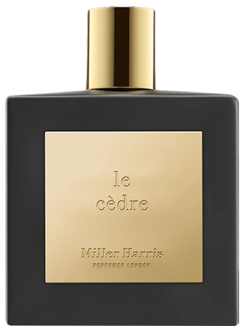

> 冬日雪后，你穿着黑色风衣向我走来

---

**品牌** ｜ 米勒海莉诗 Miller Harris  
**香水** ｜ 雪松旅馆 Cedar Woodpecker  
**香调** ｜ 辛辣木质花香调

---

### 香调结构

- **前调**：粉红胡椒、胡椒、焚香
- **中调**：兰花、含羞草  
- **基调**：雪松、木质香调、喀什米尔木、麝香

---

### 我的香评

找不到比经典香评更贴切的描述——在冬日的雪中行走，看到了温暖的雪松木屋，推门而入，壁炉里的火焰正安静地跳动。

非常非常雪松。

我曾经和朋友打翻雪松精油，洒在她胳膊上，于是她便成了一个巨大的雪松精油扩香仪。我们嗅到之后，一下午都在上海寻找各种雪松调的香水。

雪松旅馆，就是极其雪松的香水。中后调又有一些悠远的甜。

适合冬天，但四季不变——不会因为气温和体温改变气味。留香持久，喷在衣服上可以持续6个小时。

我的 Top 3 之一，一般会在心情宁静开阔的一天使用。

如果要用一句话描述：冬天漫无边际的雪后，你穿着黑色的风衣向我走来。你的拥抱给我的安心感——冬日雪后清冽的空气就是雪松调，而你，就是雪松调中悠远的一点甜。
